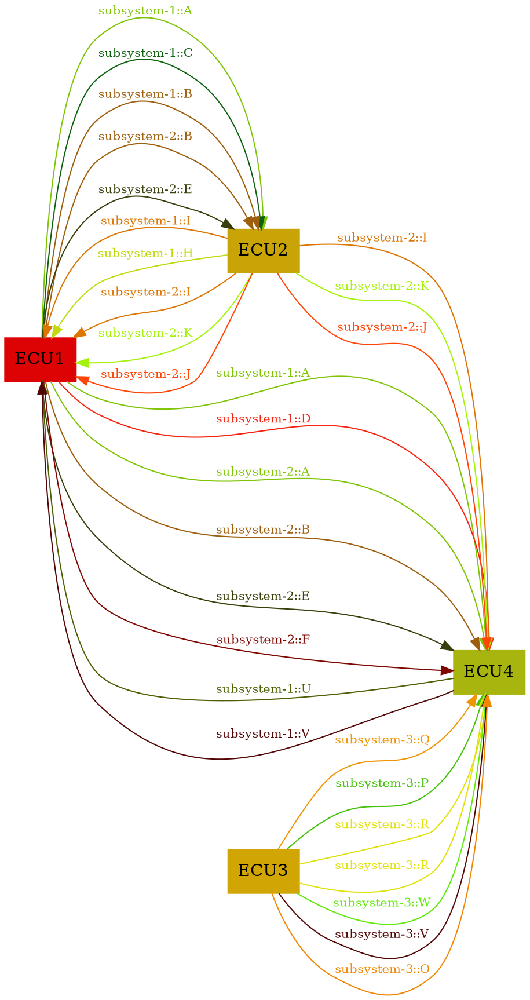

subsystem-1.yaml
==========================
subsystem-2.yaml
==========================
subsystem-3.yaml
==========================

Generated Data
==========================

```yaml
ECU1:
  Receiving:
    H:
      subsystem-1:
      - ECU2
    I:
      subsystem-1:
      - ECU2
      subsystem-2:
      - ECU2
    J:
      subsystem-2:
      - ECU2
    K:
      subsystem-2:
      - ECU2
    U:
      subsystem-1:
      - ECU4
    V:
      subsystem-1:
      - ECU4
  Sending:
    A:
      subsystem-1:
      - ECU4
      - ECU2
      subsystem-2:
      - ECU4
    B:
      subsystem-1:
      - ECU2
      subsystem-2:
      - ECU4
      - ECU2
    C:
      subsystem-1:
      - ECU2
    D:
      subsystem-1:
      - ECU4
    E:
      subsystem-2:
      - ECU4
      - ECU2
    F:
      subsystem-2:
      - ECU4
ECU2:
  Receiving:
    A:
      subsystem-1:
      - ECU1
    B:
      subsystem-1:
      - ECU1
      subsystem-2:
      - ECU1
    C:
      subsystem-1:
      - ECU1
    E:
      subsystem-2:
      - ECU1
  Sending:
    H:
      subsystem-1:
      - ECU1
    I:
      subsystem-1:
      - ECU1
      subsystem-2:
      - ECU4
      - ECU1
    J:
      subsystem-2:
      - ECU4
      - ECU1
    K:
      subsystem-2:
      - ECU4
      - ECU1
ECU3:
  Sending:
    O:
      subsystem-3:
      - ECU4
    P:
      subsystem-3:
      - ECU4
    Q:
      subsystem-3:
      - ECU4
    R:
      subsystem-3:
      - ECU4
    V:
      subsystem-3:
      - ECU4
    W:
      subsystem-3:
      - ECU4
ECU4:
  Receiving:
    A:
      subsystem-1:
      - ECU1
      subsystem-2:
      - ECU1
    B:
      subsystem-2:
      - ECU1
    D:
      subsystem-1:
      - ECU1
    E:
      subsystem-2:
      - ECU1
    F:
      subsystem-2:
      - ECU1
    I:
      subsystem-2:
      - ECU2
    J:
      subsystem-2:
      - ECU2
    K:
      subsystem-2:
      - ECU2
    O:
      subsystem-3:
      - ECU3
    P:
      subsystem-3:
      - ECU3
    Q:
      subsystem-3:
      - ECU3
    R:
      subsystem-3:
      - ECU3
      - ECU3
    V:
      subsystem-3:
      - ECU3
    W:
      subsystem-3:
      - ECU3
  Sending:
    U:
      subsystem-1:
      - ECU1
    V:
      subsystem-1:
      - ECU1
```
Generated Graphviz Source
==========================



