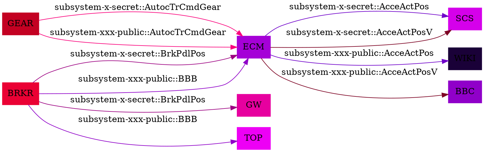

subsystem-x-secret.csv
==========================
|Short Name|Long Name|Publisher|Subscriber|Feature02:EBD|Feature05:ABS|Feature06:TCS|Feature07:SCS  |
| --- |--- |--- |--- |--- |--- |--- |--- |
|`AcceActPos` |`Accelerator Actual  Position` |`ECM` |`SCS` |`T` |`T` |`T` |`T` |
|`AcceActPosV` |`Accelerator Actual  Position Validity` |`ECM` |`SCS` |`T` |`T` |`T` |`T` |
|`AutocTrCmdGear` |`Automatic Transimission Commanded Gear` |`GEAR` |`ECM` |`T` |`T` |`T` | |
|`BrkPdlPos` |`Brake Pedal Position` |`BRKR` |`GW`\|`ECM` | | | |`T` |

subsystem-xxx-public.csv
==========================
|Short Name|Long Name|Publisher|Subscriber|Feature02:EBD|Feature05:ABS|Feature06:TCS|Feature07:SCS  |
| --- |--- |--- |--- |--- |--- |--- |--- |
|`AcceActPos` |`Accelerator Actual  Position` |`ECM` |`WIKI` |`T` |`T` |`T` |`T` |
|`AcceActPosV` |`Accelerator Actual  Position Validity` |`ECM` |`BBC` |`T` |`T` |`T` |`T` |
|`AutocTrCmdGear` |`Automatic Transimission Commanded Gear` |`GEAR` |`ECM` |`T` |`T` |`T` | |
|`BBB` |`Brake Bread Beer` |`BRKR` |`TOP`\|`ECM` | | | |`T` |


Generated Data
==========================

```yaml
BBC:
  Receiving:
    Accelerator Actual  Position Validity:
      subsystem-xxx-public:
      - ECM
BRKR:
  Sending:
    Brake Bread Beer:
      subsystem-xxx-public:
      - TOP
      - ECM
    Brake Pedal Position:
      subsystem-x-secret:
      - GW
      - ECM
ECM:
  Receiving:
    Automatic Transimission Commanded Gear:
      subsystem-x-secret:
      - GEAR
      subsystem-xxx-public:
      - GEAR
    Brake Bread Beer:
      subsystem-xxx-public:
      - BRKR
    Brake Pedal Position:
      subsystem-x-secret:
      - BRKR
  Sending:
    Accelerator Actual  Position:
      subsystem-x-secret:
      - SCS
      subsystem-xxx-public:
      - WIKI
    Accelerator Actual  Position Validity:
      subsystem-x-secret:
      - SCS
      subsystem-xxx-public:
      - BBC
GEAR:
  Sending:
    Automatic Transimission Commanded Gear:
      subsystem-x-secret:
      - ECM
      subsystem-xxx-public:
      - ECM
GW:
  Receiving:
    Brake Pedal Position:
      subsystem-x-secret:
      - BRKR
SCS:
  Receiving:
    Accelerator Actual  Position:
      subsystem-x-secret:
      - ECM
    Accelerator Actual  Position Validity:
      subsystem-x-secret:
      - ECM
TOP:
  Receiving:
    Brake Bread Beer:
      subsystem-xxx-public:
      - BRKR
WIKI:
  Receiving:
    Accelerator Actual  Position:
      subsystem-xxx-public:
      - ECM
```
Generated Graphviz Source
==========================

