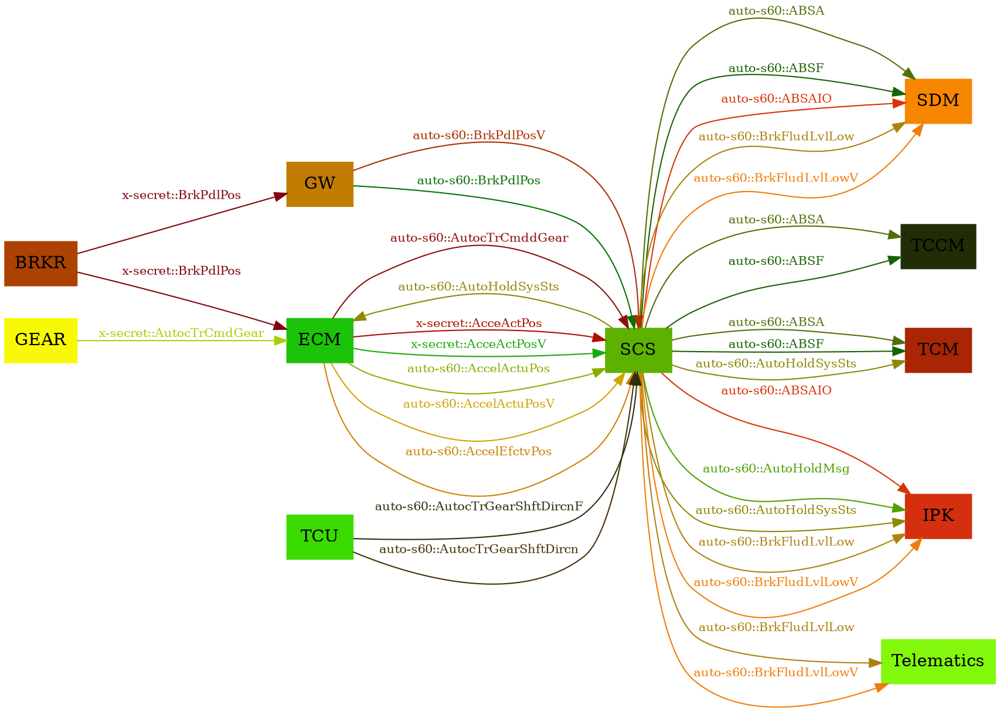

x-secret.csv
==========================
|Signal Name (Short Name)|Signal Name (Long Name)|Publisher|Subscriber|Feature02:EBD|Feature05:ABS|Feature06:TCS|Feature07:SCS  |
| --- |--- |--- |--- |--- |--- |--- |--- |
|`AcceActPos` |`Accelerator Actual  Position` |`ECM` |`SCS` |`T` |`T` |`T` |`T` |
|`AcceActPosV` |`Accelerator Actual  Position Validity` |`ECM` |`SCS` |`T` |`T` |`T` |`T` |
|`AutocTrCmdGear` |`Automatic Transimission Commanded Gear` |`GEAR` |`ECM` |`T` |`T` |`T` | |
|`BrkPdlPos` |`Brake Pedal Position` |`BRKR` |`GW`\|`ECM` | | | |`T` |

auto-s60.csv
==========================
|Signal Name (Long Name)|Signal Name (Short Name)|Publisher|Subscriber|(Feature01: Miscellaneous Information)|(Feature02: Electronic Brake force Distribution)|(Feature 05: Antilock Brake System)|(Feature 06: Traction Control System)|(Feature 07: Stability Control System)|(Feature 11: Auto Vehicle Hold)|(Feature 13: Adaptive Cruise Control Braking)|(Feature 20: Brake Disk Cleaning)|(Feature 30: Hill Hold Control)|
| --- |--- |--- |--- |--- |--- |--- |--- |--- |--- |--- |--- |--- |
|`Accelerator Actual Position` |`AccelActuPos` |`ECM` |`SCS` | | | |`T` |`T` |`T` |`T` |`T` | |
|`Accelerator Actual Position Validity` |`AccelActuPosV` |`ECM` |`SCS` | | | |`T` |`T` |`T` |`T` |`T` | |
|`Accelerator Effective Position` |`AccelEfctvPos` |`ECM` |`SCS` | | | |`T` |`T` |`T` | | | |
|`Antilock Brake System Active` |`ABSA` |`SCS` |`SDM`\|`TCCM`\|`TCM` | | |`T` | | | | | | |
|`Antilock Brake System Failed` |`ABSF` |`SCS` |`SDM`\|`TCCM`\|`TCM` | | |`T` | | | | | | |
|`Antilock Brake System Active Indication On` |`ABSAIO` |`SCS` |`IPK`\|`SDM` | | |`T` | | | | | | |
|`Auto Hold Message` |`AutoHoldMsg` |`SCS` |`IPK` | | |`T` | | | | | | |
|`Auto Hold System Status` |`AutoHoldSysSts` |`SCS` |`IPK`\|`ECM`\|`TCM` | | | | | |`T` | | | |
|`Automatic Transmission Commanded Gear` |`AutocTrCmddGear` |`ECM` |`SCS` | | | | | |`T` | | | |
|`Automatic Transmission Gear Shift Direction` |`AutocTrGearShftDircn` |`TCU` |`SCS` | | | |`T` |`T` | | | | |
|`Automatic Transmission Gear Shift Direction Failure` |`AutocTrGearShftDircnF` |`TCU` |`SCS` | | | |`T` |`T` | | | | |
|`Break Fluid Level Low` |`BrkFludLvlLow` |`SCS` |`IPK`\|`Telematics`\|`SDM` | | | |`T` |`T` |`T` | | | |
|`Brake Fluid Level Low Validity` |`BrkFludLvlLowV` |`SCS` |`IPK`\|`Telematics`\|`SDM` |`T` | | | | | | | | |
|`Brake Pedel Position` |`BrkPdlPos` |`GW` |`SCS` |`T` | | | | | | | | |
|`Brake Pedel Position Validity` |`BrkPdlPosV` |`GW` |`SCS` |`T` | | | | | | | | |


Generated Data
==========================

```yaml
BRKR:
  Sending:
    Brake Pedal Position:
      x-secret:
      - GW
      - ECM
ECM:
  Receiving:
    Auto Hold System Status:
      auto-s60:
      - SCS
    Automatic Transimission Commanded Gear:
      x-secret:
      - GEAR
    Brake Pedal Position:
      x-secret:
      - BRKR
  Sending:
    Accelerator Actual  Position:
      x-secret:
      - SCS
    Accelerator Actual  Position Validity:
      x-secret:
      - SCS
    Accelerator Actual Position:
      auto-s60:
      - SCS
    Accelerator Actual Position Validity:
      auto-s60:
      - SCS
    Accelerator Effective Position:
      auto-s60:
      - SCS
    Automatic Transmission Commanded Gear:
      auto-s60:
      - SCS
GEAR:
  Sending:
    Automatic Transimission Commanded Gear:
      x-secret:
      - ECM
GW:
  Receiving:
    Brake Pedal Position:
      x-secret:
      - BRKR
  Sending:
    Brake Pedel Position:
      auto-s60:
      - SCS
    Brake Pedel Position Validity:
      auto-s60:
      - SCS
IPK:
  Receiving:
    Antilock Brake System Active Indication On:
      auto-s60:
      - SCS
    Auto Hold Message:
      auto-s60:
      - SCS
    Auto Hold System Status:
      auto-s60:
      - SCS
    Brake Fluid Level Low Validity:
      auto-s60:
      - SCS
    Break Fluid Level Low:
      auto-s60:
      - SCS
SCS:
  Receiving:
    Accelerator Actual  Position:
      x-secret:
      - ECM
    Accelerator Actual  Position Validity:
      x-secret:
      - ECM
    Accelerator Actual Position:
      auto-s60:
      - ECM
    Accelerator Actual Position Validity:
      auto-s60:
      - ECM
    Accelerator Effective Position:
      auto-s60:
      - ECM
    Automatic Transmission Commanded Gear:
      auto-s60:
      - ECM
    Automatic Transmission Gear Shift Direction:
      auto-s60:
      - TCU
    Automatic Transmission Gear Shift Direction Failure:
      auto-s60:
      - TCU
    Brake Pedel Position:
      auto-s60:
      - GW
    Brake Pedel Position Validity:
      auto-s60:
      - GW
  Sending:
    Antilock Brake System Active:
      auto-s60:
      - SDM
      - TCCM
      - TCM
    Antilock Brake System Active Indication On:
      auto-s60:
      - IPK
      - SDM
    Antilock Brake System Failed:
      auto-s60:
      - SDM
      - TCCM
      - TCM
    Auto Hold Message:
      auto-s60:
      - IPK
    Auto Hold System Status:
      auto-s60:
      - IPK
      - ECM
      - TCM
    Brake Fluid Level Low Validity:
      auto-s60:
      - IPK
      - SDM
      - Telematics
    Break Fluid Level Low:
      auto-s60:
      - IPK
      - SDM
      - Telematics
SDM:
  Receiving:
    Antilock Brake System Active:
      auto-s60:
      - SCS
    Antilock Brake System Active Indication On:
      auto-s60:
      - SCS
    Antilock Brake System Failed:
      auto-s60:
      - SCS
    Brake Fluid Level Low Validity:
      auto-s60:
      - SCS
    Break Fluid Level Low:
      auto-s60:
      - SCS
TCCM:
  Receiving:
    Antilock Brake System Active:
      auto-s60:
      - SCS
    Antilock Brake System Failed:
      auto-s60:
      - SCS
TCM:
  Receiving:
    Antilock Brake System Active:
      auto-s60:
      - SCS
    Antilock Brake System Failed:
      auto-s60:
      - SCS
    Auto Hold System Status:
      auto-s60:
      - SCS
TCU:
  Sending:
    Automatic Transmission Gear Shift Direction:
      auto-s60:
      - SCS
    Automatic Transmission Gear Shift Direction Failure:
      auto-s60:
      - SCS
Telematics:
  Receiving:
    Brake Fluid Level Low Validity:
      auto-s60:
      - SCS
    Break Fluid Level Low:
      auto-s60:
      - SCS
```
Generated Graphviz Source
==========================



